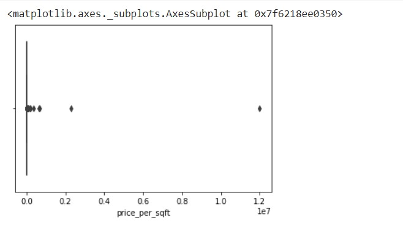
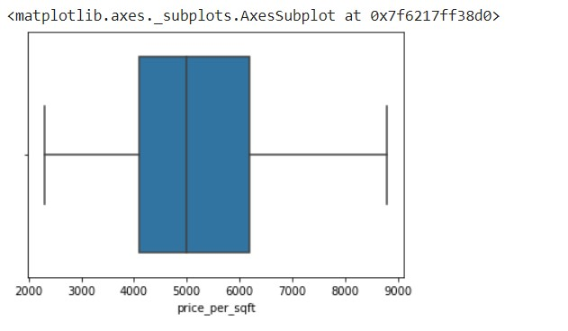
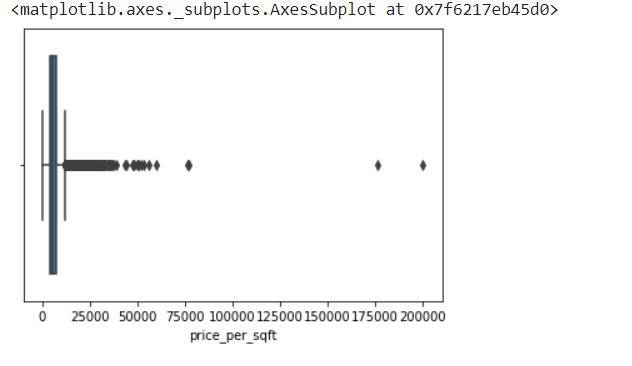
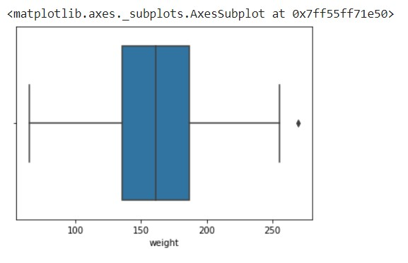
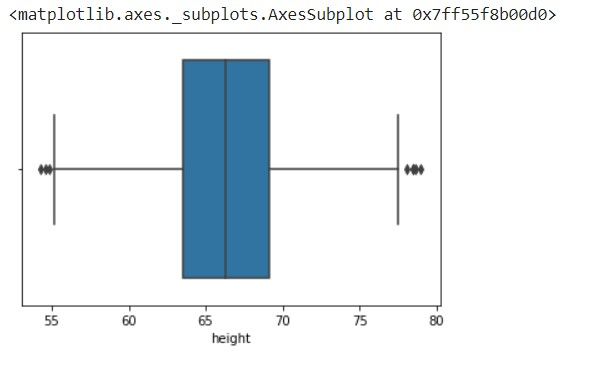
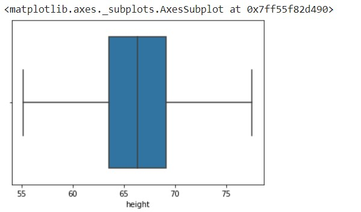

# Ex02-Outlier

## AIM
You are given bhp.csv which contains property prices in the city of banglore, India. You need to examine price_per_sqft column and do following,

(1) Remove outliers using IQR 

(2) After removing outliers in step 1, you get a new dataframe.

(3) use zscore of 3 to remove outliers. This is quite similar to IQR and you will get exact same result

(4) for the data set height_weight.csv find the following

    (i) Using IQR detect weight outliers and print them

    (ii) Using IQR, detect height outliers and print them

## ALGORITHM

### STEP 1
Read the given Data.

### STEP 2
Get the information about the data.

### STEP 3
Detect the Outliers using IQR method and Z score.

### STEP 4
Remove the outliers.

### STEP 5
Plot the datas using Box Plot.

## PROGRAM

```
NAME:M.Hariharan
REG.NO:212221230034
```
~~~
import pandas as pd
import numpy as np
import seaborn as sns
df=pd.read_csv("bhp.csv")
df
df.info()
df.isnull().sum()
sns.boxplot(x="price_per_sqft",data=df)
#Removing Outlayers using IQR
q1=df['price_per_sqft'].quantile(0.35)
q3=df['price_per_sqft'].quantile(0.65)
print("First Quantile =",q1,"\nSecond quantile =",q3)
IQR = q3-q1
ul = q3+1.5*IQR
ll = q1-1.5*IQR

df1 =df[((df['price_per_sqft']>=ll)&(df['price_per_sqft']<=ul))]
df1
sns.boxplot(x="price_per_sqft",data=df1)
#Using zscore of 3 to remove outliers
from scipy import stats

z = np.abs(stats.zscore(df['price_per_sqft']))
df2 = df[(z<3)]
df2
sns.boxplot(x="price_per_sqft",data=df2)
~~~

~~~
import pandas as pd
import numpy as np
import seaborn as sns
df=pd.read_csv("height_weight.csv")
df
df.info()
df.isnull().sum()
#Using IQR to detect weight outliers
sns.boxplot(x='weight',data=df)
q1 = df['weight'].quantile(0.25)
q3 = df['weight'].quantile(0.75)
print("First Quantile =",q1,"\nSecond Quantile =",q3)
IQR = q3-q1
ul = q3+1.5*IQR
ll = q1-1.5*IQR

df1 =df[((df['weight']>=ll)&(df['weight']<=ul))]
df1
sns.boxplot(x="weight",data=df1)
#Using IQR to detect height outliers
sns.boxplot(x='height',data=df)
q1 = df['height'].quantile(0.25)
q3 = df['height'].quantile(0.75)
print("First Quantile =",q1,"\nSecond Quantile =",q3)
IQR = q3-q1
ul = q3+1.5*IQR
ll = q1-1.5*IQR

df2 =df[((df['height']>=ll)&(df['height']<=ul))]
df2
sns.boxplot(x='height',data=df2)
~~~

## OUTPUT
### Column price_per_sqft before 

### Column price_per_sqft after performing IQR

### Column price_per_sqft after performing zscore of 3

### Column Weight without any actions

### Weight after performing IQR

### Column Height without any actions

### Height after performing IQR

## RESULT
The given datasets are read and outliers are detected and are removed using IQR and z-score methods.
